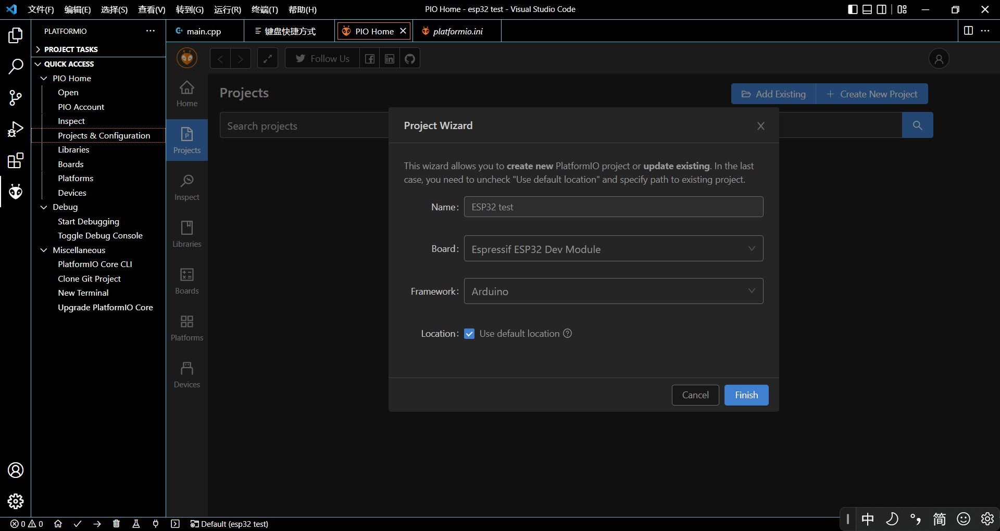
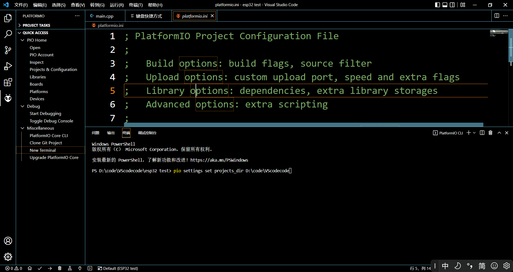

# use -ESP32-to-realize-IOT
<h1>
最初的设定
</h1>

VSCode上使用插件PlatformIO IDE来实现IOT

在这个项目的开发环境是Windows系统，VSCode软件中有PlatformIO IDE插件，额外的硬件是ESP32的开发板， 我这里淘宝买的 ESP-WROOM-32核心 + CH340驱动 + type-c接口 的开发板。

VScode很好安装，PlatformIO IDE在VScode的插件中搜名字安装，之后等待时间比较长，有魔法上网比较快。

安装完之后点击 最左侧的 PlatformIO IDE图标
等待出现界面
进入Project & Configuration 
创建新项目：点击Creat New Project
Name可以随便写，Board选择Espressif ESP32 Dev Module（代表板子是Espreeif公司型号ESP32的开发板）
文档保存路径可修改可默认

修改默认文档路径如下图，找到New terminal 输入 pio settings set projects_dir D:\code\VScodecode 回车后改变

